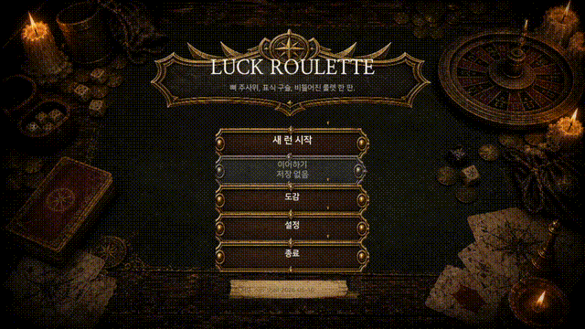
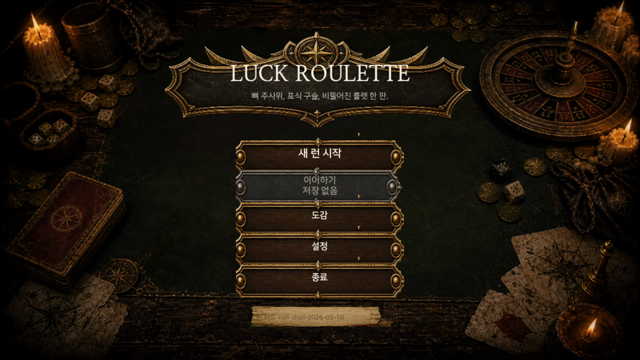

# Luck Roulette Godot

Godot 4로 만든 주사위, 구슬, 룰렛 기반 로그라이크 전투 프로토타입입니다.

플레이어는 주사위를 굴려 공격 기준값을 만들고, 구슬을 룰렛 슬롯에 배치해 특정 결과를 강화합니다. 룰렛 결과와 적의 패턴, 유물 효과가 함께 전투 결과를 만들고, 전투 이후 보상/이벤트/상점/휴식으로 이어지는 run loop를 검증하는 프로젝트입니다.



## Demo

- [Demo video](media/portfolio/luck-roulette-demo-2026-06-27.mp4)
- [Cover image](media/portfolio/luck-roulette-video-cover.png)
- [Development notes archive](docs/development-notes-current-scope-archive.md)

## What This Project Shows

- Godot 4 scene/resource 기반으로 게임 run shell을 구성한 경험
- 주사위, 구슬, 룰렛, 적 패턴, 유물 효과가 섞이는 전투 규칙 설계
- 전투 화면과 규칙을 분리하기 위한 resolver/catalog 구조
- title -> map -> combat -> reward/event/shop/rest -> run end로 이어지는 닫힌 흐름
- smoke/playtest/simulation 스크립트를 통한 회귀 검증 자산 구축

## Gameplay Loop

```text
Title
  -> Character Select
  -> Run Intro
  -> Run Map
  -> Combat
  -> Reward / Event / Shop / Rest
  -> Next Map Node or Next Floor
  -> Run Clear / Run Failed
```

Combat flow:

```text
Dice Time
  -> roll / lock dice
  -> build this-turn attack value

Marble Setup
  -> place one marble on a roulette slot
  -> that slot receives a boosted result if hit

Roulette Time
  -> spin the table roulette
  -> apply multiplier and marble boost

Enemy Time
  -> resolve monster intent and pressure
  -> update player HP / enemy HP / run state
```

## Core Systems

### Dice

`DiceResolver` converts dice results into this-turn attack value. The player can lock and reroll dice before committing to the roulette result.

### Marble

The marble is a slot modifier token. It does not simply change probability. Instead, the player chooses one roulette slot and receives a better result only if the roulette lands there.

```text
Fail x0  -> x1
Hit x1   -> x1.5
Crit x1.5 -> x2
Jackpot x2 -> x3
```

### Roulette

The table roulette is the central combat object. Base slots represent combat multipliers, and future relic/monster/event exceptions can still use explicit slot metadata through the catalog.

### Enemy Intent

Monsters use move patterns and intent text to create pressure across turns. The player can read expected danger and decide how much risk to take during dice/marble/roulette phases.

### Relics And Effects

Relics and run modifiers are applied through payload hooks so that combat rules do not have to be hard-coded into a single scene script.

## Architecture

Important entry points:

```text
project.godot
scenes/run/run_root.tscn
scripts/run/run_root.gd
scenes/battle/battle_scene.tscn
scripts/battle/battle_scene.gd
```

High-level split:

```text
RunRoot
  -> routes title, intro, map, battle, reward, event, shop, rest, run end

BattleScene
  -> owns combat phases and emits combat result payloads

systems/
  -> dice, roulette, marble, relic, monster, encounter, effect resolvers/catalogs

ui/
  -> table, hand, prompt, HUD, opponent, feedback layers
```

Representative files:

```text
scripts/systems/dice_resolver.gd
scripts/systems/roulette_resolver.gd
scripts/systems/relic_catalog.gd
scripts/systems/effect_resolver.gd
scripts/systems/monster_catalog.gd
scripts/systems/monster_move_catalog.gd
scripts/ui/table_layer.gd
scripts/ui/hand_layer.gd
scripts/ui/prompt_layer.gd
scripts/ui/run_hud.gd
scripts/ui/opponent_layer.gd
```

## Validation Assets

This repository includes smoke tests, rendered playtests, and simulation scripts for the main rules and flow contracts.

Examples:

```text
scripts/tests/smoke_run_flow.gd
scripts/tests/smoke_combat_rules.gd
scripts/tests/smoke_effect_resolver.gd
scripts/tests/smoke_relic_hook_matrix.gd
scripts/tests/smoke_shop_transaction_model.gd
scripts/tests/playtest_closed_run_loop.gd
scripts/tests/playtest_end_to_end_structure.gd
scripts/tests/sim_balance_metrics.gd
```

## Preview Frames





## Current Status

This is not a released commercial game. It is a Godot 4 prototype focused on proving a playable combat rule set and a closed roguelike run shell.

Current strengths:

- Run shell and battle scene are structurally connected.
- Dice, roulette, marble, relic, monster, encounter, and effect logic are split into dedicated systems.
- UI layers separate table, hand, prompt, HUD, and opponent presentation.
- Test/playtest assets document the intended contracts.

Known limitations:

- Final art direction is not complete.
- The presentation layer still needs polish.
- Public playable build packaging is not the current focus.
- Some older design notes are preserved in the archive rather than treated as the current product surface.

## Run Locally

Install Godot 4, open this repository, and run the main scene:

```text
res://scenes/run/run_root.tscn
```

If Godot is on `PATH`:

```powershell
godot --path .
```

Local helper scripts:

```powershell
.\open-editor.ps1
.\run-game.ps1
.\run-game.ps1 my-seed
```

Battle-only scene for combat debugging:

```text
res://scenes/battle/battle_scene.tscn
```

Run-flow smoke example:

```powershell
godot --headless --path . --script res://scripts/tests/smoke_run_flow.gd
```

Combat-rules smoke example:

```powershell
godot --headless --path . --script res://scripts/tests/smoke_combat_rules.gd
```

## Notes

The previous long-form README has been preserved here:

```text
docs/development-notes-current-scope-archive.md
```

It contains the detailed current-scope notes, refactor passes, external addon notes, and historical validation commands that were useful during development.
